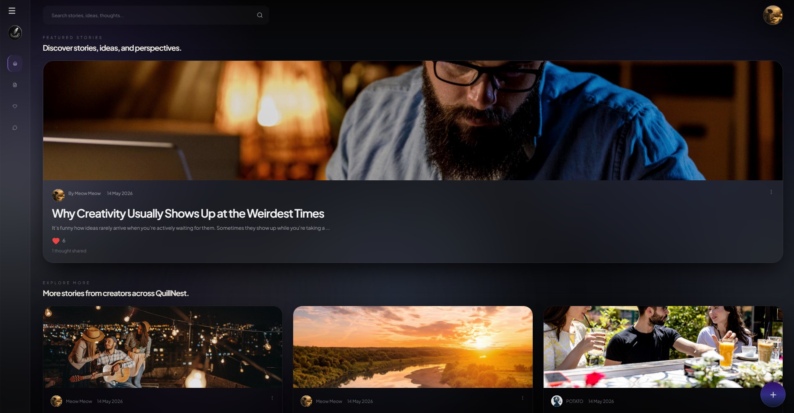
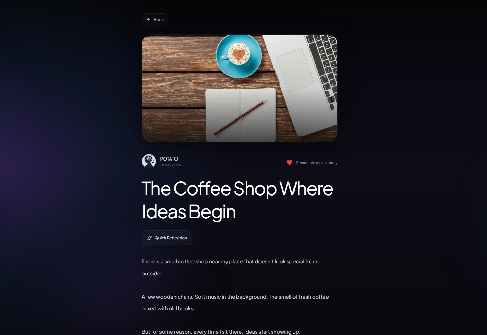

# QuillNest

QuillNest is a modern blogging platform built using Next.js and Supabase.

The platform allows users to write, discover, and interact with stories in a clean and immersive environment. It includes authentication, role-based permissions, AI-powered summaries, interactive engagement features, and a premium user interface.

---

## Project Preview

<div align="center">

| Home Page                                                       | Blog Post Page                                                       |
| --------------------------------------------------------------- | -------------------------------------------------------------------- |
|  |  |

| Create Post                                                              | User Profile                                                          |
| ------------------------------------------------------------------------ | --------------------------------------------------------------------- |
|  |  |

</div>

> A quick look at the main user experience, including content discovery, post creation, and profile management.

---


## Project Overview

This project was built as part of a full-stack development with the goal of creating a blogging platform that combines modern UI/UX with practical backend functionality.

Users can:

- Create and publish stories
- Read posts written by other users
- Like posts and join conversations through comments
- Explore writer profiles
- Manage content based on their assigned role

---

## User Roles

### Author

Authors can:

- Create new posts
- Edit their own posts
- Delete their own posts
- Interact with posts through likes and comments

### Viewer

Viewers can:

- Explore published stories
- Read AI-generated summaries
- Like posts
- Comment on posts

### Admin

Admins can:

- View all posts
- Edit any post
- Delete any post
- Monitor comments and platform activity

---

## Core Features

- Email and Google Authentication
- Role-Based Access Control
- Profile Customization with Avatars
- Create, Edit, and Delete Posts
- Featured Story Experience
- Search Functionality
- Likes and Comments System
- Writer Profile Pages
- AI Summary Generation for New Posts
- Responsive Premium Interface

---

## Technologies Used

### Frontend & Backend

- Next.js

### Database & Authentication

- Supabase

### Styling

- Tailwind CSS

### AI Integration

- Google AI API

### Version Control

- Git & GitHub

---

## Development Approach

AI-assisted development tools were used during the development process to speed up debugging, UI refinement, logic design, and feature implementation.

The final architecture, feature decisions, UI improvements, and debugging flow were manually reviewed, customized, and integrated into the final product.

---

## Running the Project

Install dependencies:

```bash
npm install
```

Start development server:

```bash
npm run dev
```

Build for production:

```bash
npm run build
```

---

## Developer

Afifa Siddiqui
